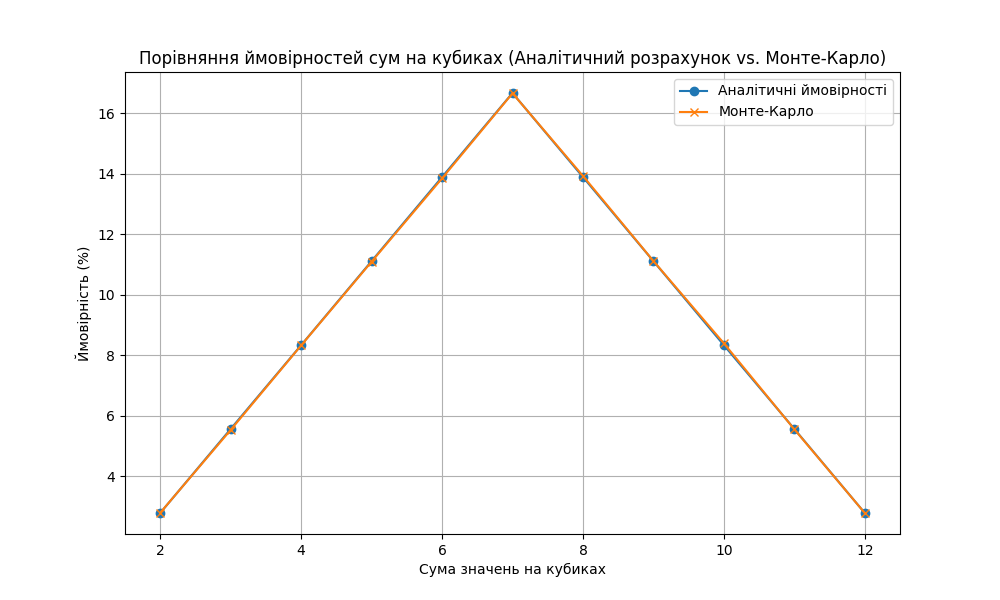

# Аналіз результатів методу Монте-Карло для кидання двох кубиків

## Вступ
Цей проєкт реалізує симуляцію кидання двох кубиків за допомогою методу Монте-Карло, щоб визначити ймовірності отримання кожної можливої суми (від 2 до 12). Результати симуляції порівнюються з аналітичними ймовірностями для оцінки точності методу Монте-Карло.

## Візуалізація результатів

## Результати симуляції
В результаті симуляції було отримано наступні ймовірності сум. Загальна кількість кидків: 1,000,000.

| Сума | Ймовірність (Монте-Карло) | Ймовірність (Аналітичний) |
|------|----------------------------|----------------------------|
| 2    | 2.78%                      | 2.78%                      |
| 3    | 5.56%                      | 5.56%                      |
| 4    | 8.33%                      | 8.33%                      |
| 5    | 11.11%                     | 11.11%                     |
| 6    | 13.89%                     | 13.89%                     |
| 7    | 16.67%                     | 16.67%                     |
| 8    | 13.89%                     | 13.89%                     |
| 9    | 11.11%                     | 11.11%                     |
| 10   | 8.33%                      | 8.33%                      |
| 11   | 5.56%                      | 5.56%                      |
| 12   | 2.78%                      | 2.78%                      |

## Висновки
Метод Монте-Карло показав високу точність у відображенні аналітичних ймовірностей, що підтверджує ефективність цього методу для великих симуляційних експериментів. Відмінності між аналітичними та отриманими результатами незначні, що доводить коректність і застосовність методу для оцінки ймовірностей у випадкових подіях.
